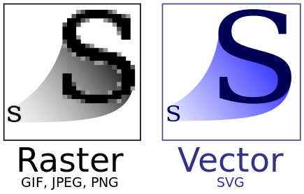

## 메쉬와 너브 커브의 차이점:

<p align="center">
  
</p>

메쉬와 너브의 차이점은 이 코끼리를 통해서 쉽게 볼 수 있습니다. 
혹은 간단하게는 2d에서 흔히 말하는 pixel을 사용하는 <i>레스터 Raster(bitmap)</i> 이미지와 수식을 사용하는 <i>벡터 vector</i> 이미지와의 차이로도 설명 가능합니다. 

<p align="center">
  
</p>

----
## 메쉬 (Mesh) 모델링

<p align="center">
  
</p>

메쉬 모델링은 다양한 폴리곤(삼각형 또는 사각형)을 이용해 3D 모델을 생성하는 방식입니다.
2d에서는 픽셀, raster 이미지로 이해가 가능하구요 코끼리에서는 타일을 만들어서 만든 첫번쨰 이미지로 설명 가능합니다. 
구성요소로는 점, 선, 면으로 대표적인 obj파일을 살펴보면 우선 점들을 나열해놓고 그뒤에 면을 정의함으로써 3d 모델을 구현합니다. 

**구성 요소**:<br>
- <i>Vertices (버텍스)</i>: 3D 공간 내의 점들로, 모델의 모양을 정의하는 기본 단위입니다.<br>
- <i>Edges (엣지)</i>: 버텍스를 연결하는 직선으로, 폴리곤의 테두리를 구성합니다.<br>
- <i>Faces (면)</i>: 엣지에 의해 둘러싸인 평면으로, 삼각형이나 사각형 형태를 가집니다.<br>

**특징**:
- 각진 형태와 구석진 모양 표현에 적합합니다.<br>
- 높은 정확도를 위해서는 많은 버텍스와 엣지가 필요하지만, 이는 컴퓨터 메모리 사용량을 증가시킵니다.<br>
- 주로 실시간 렌더링에 사용되며, 비디오 게임 등에서 빠른 렌더링 속도를 제공합니다.

### 예시 OBJ 파일의 일부


```
# 버텍스 정의 (v는 버텍스를 의미)
v 0.123 0.234 0.345  # 첫 번째 버텍스의 x, y, z 좌표
v 0.456 0.567 0.678  # 두 번째 버텍스
v 0.789 0.890 0.901  # 세 번째 버텍스

# 면 정의 (f는 면을 의미)
f 1 2 3  # 첫 번째, 두 번째, 세 번째 버텍스를 연결하여 면을 형성
```

----
## NURBS (Non-Uniform Rational B-Splines) 커브 모델링

**정의**: <br>
NURBS 커브 모델링은 복잡한 형상과 부드러운 표면을 표현하는 데 유용한 3D 모델링 방법입니다.

**구성 요소**:<br>
- <i>Control Points (컨트롤 포인트)</i>: 곡선이나 표면의 모양을 결정하는 포인트입니다.<br>
- <i>Knots (노트)</i>: 커브나 서피스의 특정 부분에 대한 가중치를 제공합니다.<br>
- <i>Weights (가중치)</i>: 컨트롤 포인트의 영향력을 조절합니다.

**특징**:<br>
- 복잡하고 부드러운 형상을 정밀하게 표현할 수 있습니다.<br>
- 주로 자동차 디자인, 항공기 디자인, 고급 애니메이션 등에서 사용됩니다.<br>
- 메쉬 모델링에 비해 더 정밀하지만, 렌더링 시간이 더 오래 걸릴 수 있습니다.

### 예시 NURBS 구성

```
# 컨트롤 포인트 정의
control_point_1 = (0.123, 0.234, 0.345)
control_point_2 = (0.456, 0.567, 0.678)
control_point_3 = (0.789, 0.890, 0.901)

# 가중치 정의
weight_1 = 1.0
weight_2 = 0.5
weight_3 = 0.8

# 노트 벡터 정의
knot_vector = [0, 0, 0, 1, 1, 1]
```