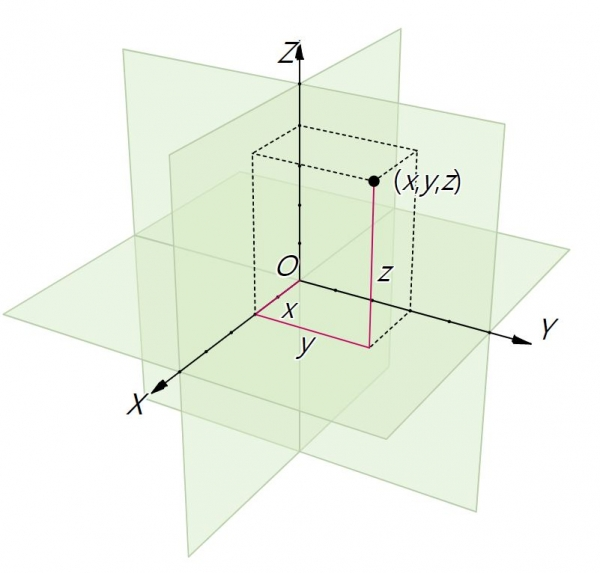

### 모든것은 파리때문에

----

  

3D가 왜 단순히 디자인의 영역이 아닌 수학, 철학, 컴퓨터등 모든 영역을 다루는지 한번 역사 속 예를 통해 이야기 해드릴게요, 

르네 데카르트는 **"나는 생각한다, 고로 존재한다"**는 유명한 말을 남긴 철학자이자 수학자입니다.  
이 말은 그가 철학자로서 어떤 사고방식을 가졌는지를 잘 보여줍니다.

데카르트는 모든 지식을 의심하고, 명확하고 확실한 것만을 진리로 받아들이자는 방법론을 제안했습니다.

> 데카르트는 이런 방식으로 신의 존재를 증명하려 했으며, 
물질 세계의 진리를 찾아내는 논리적인 순서를 세웠습니다.  
이에 따라 물질 세계는 수학적으로 계산 가능하며,  
계산을 통해 인간이 자연을 이해하고 지배할 수 있다고 주장했습니다.

데카르트의 이러한 철학적 방법론은 많은 학자들에게 영향을 미쳤고, 근대 자연과학과 수학의 발전을 이끌었습니다.  
서양이 중세의 사고방식에서 벗어나 근대 철학과 과학으로 나아가는 데 결정적인 역할을 했습니다. 

이 때문에 많은 사람들이 데카르트를 '근대 철학의 아버지'라고 부릅니다.

----

### 데카르트 좌표계

데카르트와 관련하여 빼놓을 수 없는 것은 바로 좌표 평면입니다. 

데카르트는 건강이 좋지 않아 많은 시간을 침대에서 보냈으며,   
어느 날 천장에 앉아있던 파리를 관찰하고 있었습니다.  
이 파리는 계속 움직이며 다른 위치에 앉았는데, 

데카르트는 이 파리의 위치를 객관적으로 나타낼 수 있는 방법을 고민하다, 
천장을 가로축과 세로축으로 나누고, 순서쌍으로 파리의 위치를 나타내는 직교 좌표계를 고안했습니다.

  <iframe width="600" height="315" src="https://www.youtube.com/embed/HUrf08PbI8k" title="YouTube video player" frameborder="0" allow=allowfullscreen></iframe>

----

바로 여기서 이 좌표계에 의해 우리는 3D 형상을 수학적으로 구현할 수 있게 됩니다.

데카르트 좌표계는 **X, Y, Z** 세 축을 사용하여 3차원 공간에서의 위치를 표현합니다. 

이는 모든 객체의 위치, 방향, 크기를 정의하는 기본적인 방법입니다.

  

----

### 왜 중요할까요?

데카르트 좌표계의 중요성은 단순히 위치를 특정하는 것을 넘어서, 현대 과학과 기술, 그리고 우리의 일상 생활에 깊이 뿌리내리고 있습니다.

<i>기하학과 대수학의 연결</I>: 데카르트 좌표계는 기하학적 형상과 대수적 방정식 간의 연결을 제공합니다.   이를 통해 복잡한 기하학적 문제를 대수적으로 해결할 수 있게 되었으며, 수학의 많은 분야에서 혁신을 가능하게 했습니다.

<i>3차원 모델링과 시각화</i>: 3D 모델링 소프트웨어는 데카르트 좌표계를 사용하여 공간 내의 객체를 정확히 표현합니다.  이는 건축, 엔지니어링, 게임 개발, 영화 제작 등 다양한 분야에서 복잡한 3차원 객체와 환경을 생성하고 조작하는 데 필수적입니다.

<i>과학적 발견과 탐험</i>: 물리학에서 천문학에 이르기까지, 데카르트 좌표계는 자연 현상을 모델링하고 이해하는 데 중추적인 역할을 합니다.  우주의 심오한 구조에서 지구상의 작은 생물체까지, 모든 것을 수학적으로 설명하고 예측하는 데 기여합니다.

<i>기술 혁신의 기반</i>: GPS 기술에서 로봇 공학, 가상 현실에 이르기까지, 데카르트 좌표계는 정밀한 위치 결정과 객체의 움직임을 제어하는 기술의 핵심입니다.  이 좌표계 없이는 현대 기술의 많은 발전이 불가능했을 것입니다.

----

### 프로그램과 좌표계

다양한 3D 모델링 프로그램은 좌표계를 약간 다르게 해석합니다.3D 모델링 프로그램에서 사용하는 좌표계는 'Z-up' 또는 'Y-up'으로 구분될 뿐만 아니라, 이들 좌표계는 '오른손 좌표계(Right-Handed Coordinate System)' 또는 '왼손 좌표계(Left-Handed Coordinate System)'로도 구분됩니다. 이 구분은 공간의 세 축(X, Y, Z) 간의 방향성과 관련이 있으며, 3D 공간에서의 회전 방향, 법선 벡터의 방향 등을 결정하는 데 중요한 역할을 합니다.:

><i>오른손 좌표계(Right-Handed Coordinate System)</i>: 오른손을 사용하여 방향을 가리킬 때, 엄지손가락이 Z축의 '위' 방향을 가리킵니다. 
><i>왼손 좌표계(Left-Handed Coordinate System)</i>: 왼손을 사용하여 방향을 가리킬 때, 엄지손가락이 Z축의 '위' 방향을 가리킵니다.

  

  **Y-up:** 
      라이노 (Rhino)

  **Z-up:**  
  스케치업 (SketchUp) 
  캐드 (AutoCAD) 
  레빗 (Revit) 
  블렌더 (Blender) 

이러한 차이를 이해하고 각 프로그램의 좌표계에 맞게 작업하는 것은 3D 모델링에서 매우 중요합니다. 프로젝트를 다른 소프트웨어로 이전할 때 이러한 차이점을 고려해야 합니다.

----

