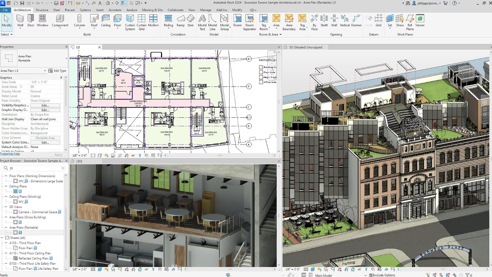

### 3.Revit - Autodesk 

  

Autodesk Revit은 건축가, 조경사, 구조 엔지니어, 기계, 전기 및 배관 (MEP) 엔지니어, 설계자 및 시공업체 를 위한 건축 정보 모델링 소프트웨어 입니다 .
이 소프트웨어를 사용하면 사용자는 건물과 구조 및 그 구성 요소를 3D 로 설계하고 2D 제도 로 모델에 주석을 달 수 있습니다. 요소를 확인하고 건물 모델의 데이터베이스에서 건물 정보에 액세스합니다. Revit은 개념부터 건설, 이후 유지 관리 및/또는 철거에 이르기까지 건물 수명주기의 다양한 단계를 계획하고 추적하는 도구를 갖춘 4D 건물 정보 모델링 애플리케이션 입니다 .

처음부터 Revit은 건축 정보 모델링(BIM)이라고도 알려진 형상 및 비기하학적 설계 및 건설 정보를 모두 포함하는 파라메트릭 3차원 모델을 생성하여 건축가 및 기타 건축 전문가가 건물을 설계하고 문서화할 수 있도록 의도되었습니다. Revit의 주요 차이점은 사용자가 프로그래밍 언어가 아닌 그래픽 "패밀리 편집기"에서 파라메트릭 구성요소를 생성했으며 모델이 구성요소, 뷰 및 주석 간의 모든 관계를 캡처하여 모든 요소에 대한 변경 사항이 자동으로 전파되어 모델을 유지한다는 것입니다. 

예를 들어, 벽을 이동하면 인접한 벽, 바닥 및 지붕이 업데이트되고, 치수 및 메모의 배치와 값이 수정되고, 일람표에 보고된 바닥 면적이 조정되고, 단면 뷰가 다시 그려지는 등의 작업을 통해 모델이 연결된 상태를 유지하고 모든 문서가 조정되었습니다. 구성요소, 뷰 및 주석 간의 양방향 연관성 개념은 많은 릴리스에서 Revit의 차별화된 기능이었습니다. 쉽게 변경할 수 있다는 점에서 **Revise-Instantly** 의 축약형인 Revit이라는 이름이 탄생했습니다. 

Revit은 엔지니어, 건축가 및 계약자를 위해 설계되었으며, Autodesk의 BIM 플랫폼으로 국제적으로 널리 채택되었습니다. IFC(Industry Foundation Classes) 데이터 모델 공유와 다른 Autodesk 제품과의 호환성으로 인해 전문가들에게 유리합니다. 그러나 Revit은 학습 곡선이 가파르고, 사용자 인터페이스가 둔감하며, 편집 기능이 부족하고, 공학에 지나치게 중점을 두는 점 등으로 비판을 받습니다.

----

Revit 작업 환경을 사용하면 사용자는 전체 건물이나 조립품(프로젝트 환경에서) 또는 개별 3D 모양(패밀리 편집기 환경에서)을 조작할 수 있습니다. 모델링 도구는 미리 만들어진 솔리드 객체 또는 가져온 기하학적 모델과 함께 사용할 수 있습니다. 그러나 Revit은 NURBS 모델러 가 아니며 지붕, 슬래브, 지형 또는 매스 환경과 같은 일부 특정 객체 유형을 제외하고 객체의 개별 다각형을 조작하는 기능도 부족합니다.

Revit에는 객체 카테고리(Revit 용어로 '패밀리')가 포함되어 있습니다. 이는 세 그룹으로 나뉩니다.

벽, 바닥, 지붕, 천장, 주요 마감재, 심지어 프로젝트 내부에 구축된 가구와 같은 시스템 제품군
프로젝트와 별도로 기본 요소(돌출, 스윕 등)로 작성되고 사용을 위해 프로젝트에 로드되는 로드 가능한 패밀리/구성요소
로드 가능한 구성요소와 동일한 도구 세트를 사용하여 프로젝트 내에서 현장에 구축된 패밀리 내부편집

숙련된 사용자는 가구에서 조명 기구에 이르기까지 현실적이고 정확한 패밀리를 만들 수 있을 뿐만 아니라 다른 프로그램에서 기존 모델을 가져올 수 있습니다. Revit 패밀리는 치수 및 특성이 포함된 파라메트릭 모델로 생성될 수 있습니다. 이를 통해 사용자는 배열의 경우 높이 , 너비 또는 숫자 와 같은 사전 정의된 매개변수를 변경하여 특정 구성요소를 수정할 수 있습니다 . 이러한 방식으로 패밀리는 매개변수로 제어되는 형상을 정의하고, 각 매개변수 조합을 유형으로 저장할 수 있으며 , 유형 의 각 발생(Revit의 인스턴스)에도 추가 변형이 포함될 수 있습니다. 예를 들어, 여닫이문은 패밀리일 수 있습니다. 다양한 크기를 설명하는 유형이 있을 수 있으며 실제 건물 모델에는 인스턴스 기반 매개변수가 문 발생마다 고유하게 문 하드웨어를 지정할 수 있는 벽에 배치된 유형의 인스턴스(instance)가 있습니다.

프로젝트 작업의 저작권 문제로 인해 완전히 3D 모델링된 Revit 프로젝트 모델은 거의 판매되지 않습니다. 실제로 대부분의 프로젝트가 현장 특정적이고 맞춤형이기 때문에 기존 모델에 대한 수요는 어쨌든 적습니다. 그러나 새로운 실습이나 Revit 학생은 완성된 모델을 참조할 수 있습니다. BIMGallery 및 GrabCad와 같은 웹사이트를 포함하여 이에 대한 몇 가지 소스가 있습니다.

----
### 다중 사용자 협업 

Revit에서는 여러 사용자가 동일한 건물 모델에서 작업할 수 있습니다. 워크플로는 여러 개발자가 공통 코드 기반에서 안정적으로 협업할 수 있도록 하는 소프트웨어 엔지니어링의 버전 제어 시스템을 사용하는 것과 유사합니다. 각 Revit 사용자는 설계의 로컬 복사본으로 작업하며 정기적으로 작업을 중앙 저장소에 체크인합니다. 새 사용자는 이 저장소의 로컬 복사본을 만드는 것부터 시작합니다. 사용자가 일부 건물 요소를 수정하기 시작하면 이러한 요소는 자동으로 잠기므로 다른 사람이 수정할 수 없습니다. 잠금은 중앙 저장소에 유지됩니다. 요소는 "차용자"가 작업을 확인하고 잠금을 해제할 때까지 잠긴 상태로 유지됩니다. "작업 공유"라는 특허 기술을 사용하면 Revit에서 잠긴 요소 세트를 최소화하는 동시에 변경 전파 엔진이 잠기지 않은 요소를 포함하여 필요한 만큼의 요소를 업데이트할 수 있습니다. Revit은 일반적으로 체크인 중에 병합 충돌을 방지합니다.

Autodesk는 Revit용 호스팅된 클라우드 기반 중앙 저장소도 서비스로 제공합니다.

----
### 렌더링 
사용자가 Revit에서 건물, 모델 또는 기타 모든 종류의 객체를 생성할 때 Revit의 렌더링 엔진을 사용하여 매우 도식적인 모델에 대한 보다 사실적인 이미지를 만들 수 있습니다. 사용자는 미리 만들어진 모델, 벽, 바닥 등의 도구를 사용하거나 자신만의 모델, 벽, 재료 등을 만들어 이를 수행합니다. Revit 2010에는 미리 정의된 다양한 재료가 함께 제공되며 각 재료는 원하는 대로 수정할 수 있습니다. 사용자의 욕구. 사용자는 "일반" 자료로 시작할 수도 있습니다. 이를 통해 사용자는 텍스처, 광택 맵(샤인맵이라고도 함), 투명도 맵, 반사 맵 , 경사 반사 맵, 구멍 맵 및 범프 맵 의 회전, 크기, 밝기 및 강도를 설정할 수 있을 뿐만 아니라 부분을 ​​매핑하고 앞서 언급한 텍스처 기능 중 하나(또는 전부 또는 전혀)에 대해 슬라이더를 사용하면 됩니다.

Autodesk Labs에 있는 Project Neon이라는 실험적 플러그인을 사용한 클라우드 기반 렌더링은 베타 단계에 있으며 사용자가 로컬 컴퓨터 대신 Autodesk 계정을 통해 이미지를 렌더링할 수 있습니다. 또한 Revit 모델은 Autodesk 3ds Max (릴리스 2013 이상) 에 직접 연결되어 대부분의 재료 및 개체 정보가 유지되는 고급 렌더링 및 애니메이션 프로젝트를 수행할 수도 있습니다.

----

**장점**

1. 통합된 디자인 환경: Revit은 건축, 구조, MEP 분야의 전문가들이 하나의 통합된 환경에서 작업할 수 있게 합니다. 이는 팀 간의 협업을 촉진하고 프로젝트의 효율성을 향상시킵니다.
2. BIM 지원: Revit은 BIM을 지원하므로, 건축물의 모든 구성 요소를 3D로 모델링하고 이에 대한 정보를 관리할 수 있습니다. 이는 건축물의 생애 주기 전반에 걸친 의사 결정 과정을 지원합니다.
3.호환성: Revit은 IFC 데이터 모델 공유를 지원하며, 다른 Autodesk 제품과의 호환성이 뛰어납니다. 이는 다양한 소프트웨어와의 원활한 통합을 가능하게 합니다.

**단점**

1. 학습 곡선: Revit의 학습 곡선은 가파르며, 처음 사용자에게는 이해하고 익히기 어려울 수 있습니다.
2. 사용자 인터페이스: 일부 사용자는 Revit의 사용자 인터페이스를 둔감하다고 느낄 수 있습니다. 이는 효율성을 저해하고 작업 과정에 불편을 초래할 수 있습니다.
3. 편집 기능: Revit의 편집 기능은 다소 제한적입니다. 예를 들어, 복잡한 형상의 모델링에는 불편함을 느낄 수 있습니다.
4. 공학 중심: Revit은 공학에 중점을 두고 설계되었습니다. 따라서, 예술적이거나 창의적인 디자인에는 제한적일 수 있습니다.

----
