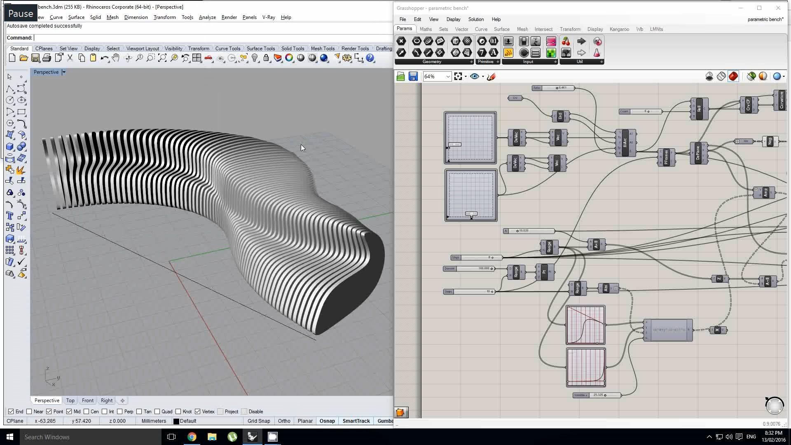

4.Rhino 3D – McNeel & Associates 

  

Rhino 3D는 유연한 NURBS(Non-Uniform Rational B-Splines) 모델링 시스템을 기반으로 하는 강력한 3D 모델링 소프트웨어입니다. 

Rhinoceros 기하학은 NURBS 수학적 모델 을 기반으로 하며 , 컴퓨터 그래픽 에서 곡선과 자유형 표면 을 수학적으로 정확하게 표현하는 데 중점을 둡니다 ( 다각형 메쉬 기반 응용 프로그램 과 반대 ).

Rhinoceros는 건축 , 산업 디자인 (예: 자동차 디자인 , 선박 디자인), 제품 디자인 (예: 보석 디자인 ) 을 포함한 산업에서 컴퓨터 지원 설계(CAD), 컴퓨터 지원 제조(CAM) , 쾌속 프로토타이핑 , 3D 프린팅 및 리버스 엔지니어링 에 사용됩니다. ) 뿐만 아니라 멀티미디어 및 그래픽 디자인 에도 적용됩니다 . [2]

라이노는 자체적으로 개발한 3D 모델링 커널[2]에 넙스(NURBS[3]) 기반의 서피스 툴 위주로 제공해 왔다. NURBS란 한마디로 컴퓨터 그래픽스 분야에서 커브(curve)나 서피스(surface)를 수학적으로 표현해내기위해 1970년대 초에 이론체계가 짜여진 오래된 방식이다. 엔터프라이즈용 M-CAD를 비롯하여 대부분의 3D CAD들이 NURBS방식의 서피스 디자인 툴에 더해 직관적 디자인이 가능한 SubD[4] 방식의 서피스 디자인 툴을 모듈/애드인 형태로 제공해 왔으며, 라이노도 버젼 7부터 SubD 기반 모델링을 탑재하였다.

모든 물체를 만들 때 Closed Polysurface(Solid라고도 함)로 만드는 습관을 들이는 것이 좋다. Open Polysurface와의 차이점은, 표면이 완전히 막혀 있어서 내부 부피가 있다는 점이다. 현실 세계에서 부피가 0인 물체가 없는 것처럼 모델링에서도 그런 것이 있으면 언젠가 꼬이게 된다. 그리고 Boolean[6] 작업에 필수적이다. 3d 프린팅 시 닫힌 폴리서피스여야만 출력 오류가 생기지 않는 데, 라이노 자체에서 닫힌 폴리서피스로 모델링하게 되므로 3d 프린팅 시에 별다른 검토나 오류의 빈도가 적다.

V-Ray 플러그인을 사용해 라이노파일을 연채로 렌더가 가능하다. V-Ray 는 많은 기능을 가지고 높은 퀄리티의 렌더를 만들 수 있으나 기능이 많다는 점으로 인해 초반 학습이 어려운 편이다. 렌더 시간이 긴 편이다. 이런 단점을 지울 수 있을 정도의 퀄리티의 이미지를 만들 수 있다는 것이 장점이다.

이는 건축가, 디자이너, 엔지니어 등 다양한 분야의 전문가들 사이에서 널리 사용됩니다. Rhino의 주요 장점 중 하나는 그것의 다양성과 정확성으로, 복잡하고 정교한 모델을 생성하는 데 매우 효과적입니다.Rhino는 또한 확장성이 뛰어난 플랫폼으로, 다양한 플러그인과 스크립트를 지원합니다. 이 중 가장 유명한 것은 Grasshopper라는 시각적 프로그래밍 언어입니다. Grasshopper는 알고리즘 기반의 디자인 프로세스를 가능하게 하여, 사용자가 복잡한 형태와 구조를 쉽게 탐색하고 실험할 수 있게 합니다.
Rhino는 또한 다른 CAD 및 BIM 소프트웨어와의 우수한 호환성을 자랑합니다. 이는 건축 및 디자인 프로젝트에서 다양한 툴과 워크플로우를 통합하는 데 있어 큰 장점을 제공합니다. 예를 들어, Rhino에서 생성된 모델을 ArchiCAD 또는 Revit과 같은 BIM 소프트웨어로 손쉽게 전송하고, 상호 운용할 수 있습니다. Rhino의 라이노는 주로 3D 모델링에 초점을 맞춘 소프트웨어이며, BIM(Building Information Modeling) 기능이 내장되어 있지 않습니다. 따라서, BIM 프로세스를 완전히 통합하려는 사용자들은 라이노와 다른 BIM 소프트웨어 간의 워크플로우를 조정해야 합니다.

장점:
1. 유연성: Rhino 3D는 매우 유연한 모델링 도구로, 사용자가 복잡한 형상과 구조를 쉽게 만들 수 있습니다. 이는 NURBS 기반의 모델링 시스템 덕분으로, 이 시스템은 복잡한 곡선과 서피스를 정밀하게 표현할 수 있습니다.
2. 확장성: Rhino는 다양한 플러그인과 스크립트를 지원하여, 사용자가 필요에 따라 기능을 확장할 수 있습니다. 이 중 Grasshopper는 알고리즘 기반의 디자인을 가능하게 하여, 복잡한 형태와 구조를 쉽게 탐색하고 실험할 수 있게 합니다.
3. 호환성: Rhino는 다른 CAD 및 BIM 소프트웨어와의 우수한 호환성을 자랑합니다. 이는 건축 및 디자인 프로젝트에서 다양한 툴과 워크플로우를 통합하는 데 있어 큰 장점을 제공합니다.

단점:
1. BIM 기능 부재: Rhino는 주로 3D 모델링에 초점을 맞춘 소프트웨어이며, BIM(Building Information Modeling) 기능이 내장되어 있지 않습니다. 따라서, BIM 프로세스를 완전히 통합하려는 사용자들은 라이노와 다른 BIM 소프트웨어 간의 워크플로우를 조정해야 합니다.
2. 학습곡선: Rhino는 매우 강력한 도구이지만, 그만큼 복잡하기도 합니다. 특히, Grasshopper와 같은 고급 기능을 활용하려면 상당한 학습이 필요합니다.
3. 비용: Rhino는 상당히 비싼 소프트웨어입니다. 이는 특히 개인 사용자나 작은 회사에게는 부담이 될 수 있습니다. 

