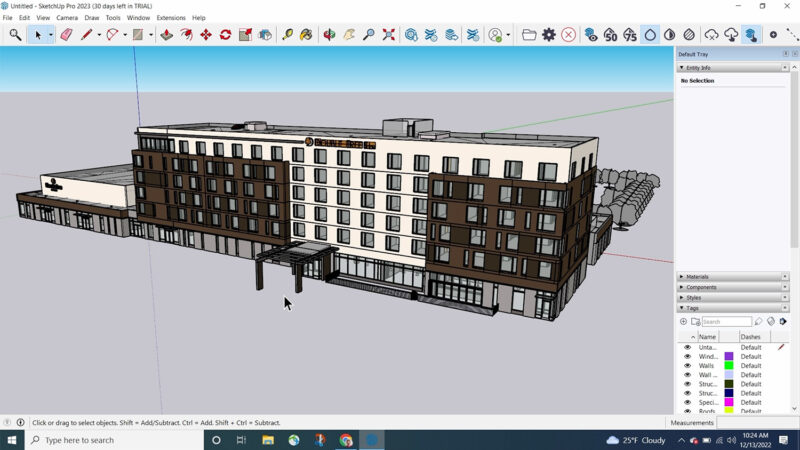

2.SketchUp - Trimble 

  

**스케치업**은 원래 2000년 8월에 앳래스트 소프트웨어(@Last Software)에서 출시하였고 2006년 구글이 구글 어스와 관련하여 @Last Software를 인수하면서 스케치업 역시 구글 산하에 있었으나 다시 2012년 트림블(Trimble)로 이전되었습니다.

스케치업은 기본적인 모델링 작업, 특히 원형이나 네모반듯한 모델링에 쉽고 빠르게 사용할 수 있습니다. 그러나 곡선과 곡면 모델링은 다소 어렵거나 플러그인을 활용해야 사용할 수 있습니다. 이 프로그램은 다른 3D 프로그램에 비해 기본 조작법이 쉽고, 한국어로 제공되는 강의 자료와 자막으로 사용자 편의성을 높입니다.

X그러나 X, Y, Z 축으로 스냅하는 방법이 특이하며 실수를 유발할 수 있습니다. 이러한 문제를 방지하려면 오른쪽, 왼쪽, 윗쪽 방향키를 누르는 사전 정의된 축 방향을 사용할 수 있습니다. 곡선과 곡면 모델링의 경우 일부 제한이 있지만 플러그인을 사용하여 기능을 확장할 수 있습니다.

그러나 사용자들이 만든 플러그인이 있기에 약간은 감당할 수 있다. 스케치업은 플러그인이 없으면 기능이 다른 도구에 비해 많이 뒤떨어진다. 그런데 플러그인 종류는 많지만, 스케치업에 잘 녹아든 플러그인은 별로 없다. 스케치업 자체의 플러그인 API가 단순하기 때문이다.

다시 말해, 입문은 정말 쉬운데 응용은 어렵다. 하지만 방대한 모델링 라이브러리 덕분에 어느 정도 상쇄된다. 응용이 어려운 이유는 박스 형태의 건축 모델링에 적합한 기능 이상을 제공하지 않기 때문이다. 결국 온전한 모델링 기능의 필요는 제대로 된 3D툴로 갈아타게 만드는 원동력이 된다. 사실 건축종사자들은 이러한 복잡한 모델링이 별로 필요 없기 때문에 Revit, ARCHICAD, 나아가 CATIA의 건축용 버전인 Digital project 등의 고급 모델링 프로그램이 주류이다.

스케치업은 렌더링 기능이 부족하며, Podium, V-Ray, Enscape와 같은 렌더링 플러그인을 사용하여 사진과 같은 렌더링 이미지를 생성해야 합니다. 또한 스케치업은 폴리곤 모델링에서 메시 토폴로지에 대한 고려를 하지 않으므로, 애니메이션 또는 물리 시뮬레이션과 같은 고급 작업에는 적합하지 않을 수 있습니다.

스케치업에서는 BIM(건축 정보 모델링)을 가능하게 하는 플러그인도 존재하며, 일부 플러그인 없이 IFC를 이용하여 BIM 프로그램처럼 사용할 수도 있습니다. 스케치업은 모델링 라이브러리가 풍부하며, 간단한 모델링에 적합하므로 입문자에게 쉽게 접근할 수 있지만, 응용 작업은 어려울 수 있습니다.

SketchUp은 학생과 전문가 모두에게 사용하기 쉬운 모델링 소프트웨어를 제공함으로써 CAD 세계에서 독특한 위치를 차지하고 있습니다. 무료 리소스가 가득한 3D 창고도 큰 장점입니다. SketchUp은 3D CAD(여기서 'D'는 '디자인'을 의미) 세계로의 쉬운 진입을 제공하지만, 전문적인 2D 드래프팅 CAD 또는 BIM 플랫폼으로 대체하기에는 적합하지 않습니다.

----
**활용 분야:**

1. **건축 및 건설 분야:** 건축가, 디자이너, 건축업자들이 건물 및 구조물의 3D 모델링, 도면 작성, 공간 디자인 및 시각화에 활용됩니다. 실내 및 실외 디자인, 건물 프로토타입, 가구 및 인테리어 설계에 사용됩니다. 국내에서는 건축현상설계, 공동주택LH 현상공모에서도 널리 사용됩니다.

2. **영화 및 애니메이션 제작:** 영화, 애니메이션, 게임 제작 분야에서도 스케치업은 3D 모델링, 캐릭터 디자인, 장면 제작, 스토리보드 작업 등에 활용됩니다.

3. **도시 계획 및 랜드스케이프 디자인:** 도시 계획가, 랜드스케이프 디자이너, 도시 개발자들은 도시 및 공공 공간, 공원, 도로 등의 디자인 및 시각화를 위해 스케치업을 활용합니다.

4. **제품 디자인:** 제품 디자이너들은 제품 모델링, 디자인 스케치를 위해 스케치업을 사용합니다.

5. **교육 및 교육자료 제작:** 교육 분야에서는 교육자료 제작, 학생들의 3D 학습 환경 제공, 건축 및 디자인 강의 등에 사용됩니다.

6. **웹툰 배경:** 웹툰 작가들은 스케치업을 사용하여 웹툰 배경을 디자인합니다. 도시 풍경, 카페, 학교, 자연 속의 풍경 등을 만들 때 편리하게 활용됩니다.

----

**장점:**

1. **사용자 친화적:** SketchUp은 사용하기 매우 쉽습니다. 사용자 인터페이스는 직관적이며, 사용자가 쉽게 배울 수 있게 설계되어 있습니다. 이는 학생들이나 CAD에 익숙하지 않은 전문가들에게 매우 유용합니다.

2. **무료 버전 제공:** SketchUp은 웹 버전을 무료로 제공합니다. 이는 학생들이나 예산이 제한적인 사용자들에게 큰 이점입니다.

3. **3D Warehouse:** SketchUp의 3D 창고는 사용자들이 자신의 모델을 공유하고 다른 사용자의 모델을 다운로드할 수 있는 곳입니다. 이는 시간과 노력을 절약하는 데 도움이 됩니다.

**단점:**

1. **제한된 기능:** SketchUp은 기본적인 3D 모델링 도구를 제공하지만, 고급 모델링 기능이나 복잡한 디자인을 위한 도구는 제한적입니다. 이는 전문적인 CAD 사용자들에게는 단점으로 작용할 수 있습니다.

2. **2D 드래프팅 및 BIM 능력 부족:** SketchUp은 3D 디자인에 초점을 맞추고 있어, 2D 드래프팅 능력이 부족하고, BIM(Building Information Modeling) 기능을 제공하지 않습니다. 이는 건축, 엔지니어링 등의 분야에서는 큰 단점으로 작용할 수 있습니다.

3. **렌더링:** SketchUp의 기본 렌더링 기능은 매우 기본적이며, 전문적인 퀄리티를 위해서는 별도의 렌더링 플러그인을 사용해야 합니다.
