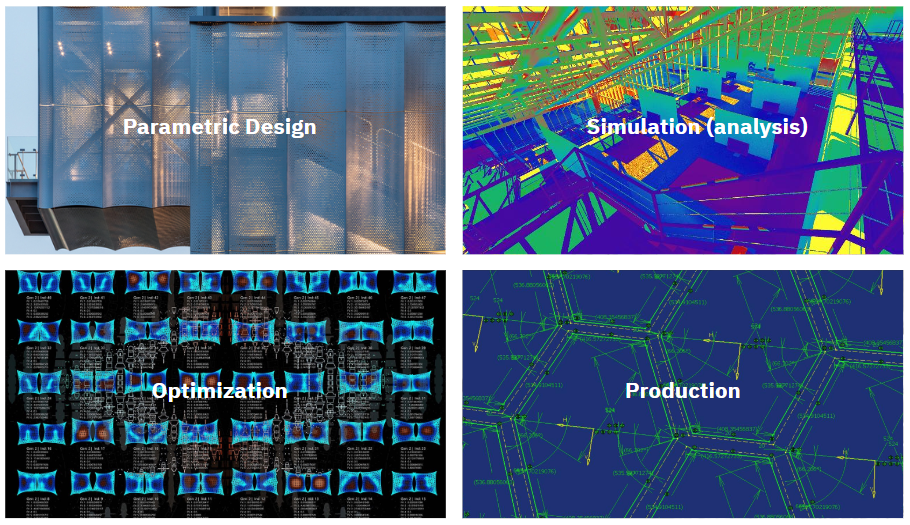

  

- **파라메트릭 디자인**:  AI는 고객의 요구 사항과 선호를 분석하여 개인화된 디자인 솔루션을 제공할 수 있습니다. 전통적인 설계 방식을 넘어서는 창의적이고 혁신적인 디자인을 가능하게 합니다.
- **시뮬레이션**:  AI는 복잡한 환경 시뮬레이션을 통해 건축물의 성능을 예측하고, 잠재적인 문제를 사전에 파악할 수 있도록 도와줍니다. AI를 활용한 설계는 에너지 효율성을 향상시키고 환경 영향을 최소화하는 데 기여
- **설계 최적화**:  AI는 건축 설계 과정에서 최적의 설계안을 제시하며, 에너지 효율, 재료 사용, 공간 활용 등 다양한 측면에서 최적화를 도모합니다.
- **자동화**:  AI는 반복적이고 시간이 많이 소요되는 작업을 자동화함으로써, 설계자의 작업 부담을 줄이고 효율성을 향상시킵니다. AI는 설계 및 건설 과정을 최적화하여 시간과 비용을 절감

----
### 2. Creativity in the Age of AI

    <iframe width="1200" height="400" src="https://www.youtube.com/embed/y7g-nRooZr8?si=yEgNCnAv8hDv1WNb"  frameborder="0" allow="accelerometer; autoplay; clipboard-write; encrypted-media; gyroscope; picture-in-picture" allowfullscreen></iframe>

