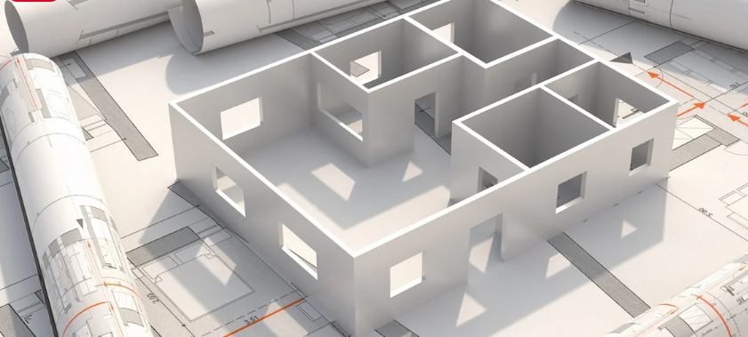

# Digital 3D Advanced 

----

### 3D 모델링이란?

  

> 컴퓨터 그래픽스를 사용하여 물체의 세 가지 차원(너비, 높이, 깊이)을 표현하는 과정.

----

### Why? 

3D 모델링은 디자인의 효율성과 정확성을 높이며, 프로토타입을 만들고 사용자 경험을 시뮬레이션하는 데 사용됩니다. 다양한 디자인 옵션을 탐색하며, 문제점을 미리 발견하고 수정할 수 있습니다. 또한, 건축물의 실제 외관과 기능을 보여주는 프레젠테이션 도구로도 활용됩니다.

----
### 이번 학기에 배울 툴들

- **스케치업 (SketchUp)**: 3D 모델링을 쉽고 빠르게 할 수 있는 툴
- **엔스케이프 (Enscape)**: 실시간 렌더링 및 가상 현실을 지원하는 툴
- **오토캐드 (AutoCAD)** : 2D 모델링이 가능한 CAD의 조상. 살아있는 화석
- **라이노 (Rhino)**: 정교한 설계와 복잡한 형상을 만드는 데 적합
- **그래스호퍼 (Grasshopper)**: 알고리즘 기반의 디자인을 가능하게 하는 플러그인
- **레빗 (Revit)**: 건축 정보 모델링(BIM)에 최적화된 툴
- **VRay**: 고급 렌더링을 위한 강력한 툴

각 툴은 고유의 기능과 특징을 가지고 있으며, 서로 보완적인 역할을 합니다. 예를 들어, 스케치업은 기본적인 3D 모델링에 적합하지만, 라이노나 그래스호퍼를 통해 더 복잡하고 상세한 디자인을 구현할 수 있습니다.

----

설계를 정확하고 효율적이며 비용 효율적으로 표현하려면 BIM 소프트웨어 사용에 대한 숙련도(또는 전문성)를 개발하는 것이 최우선 과제입니다. 따라서 어떤 소프트웨어 옵션을 선택하느냐보다 건축가에 대한 교육이 더 기본입니다. 학생은 이러한 다양한 전문 프로그램에 대한 무료 교육 라이센스에 액세스할 수 있습니다. 그러니 직접 시승해보고, 과일을 맛보고, 스스로 결정하세요.
