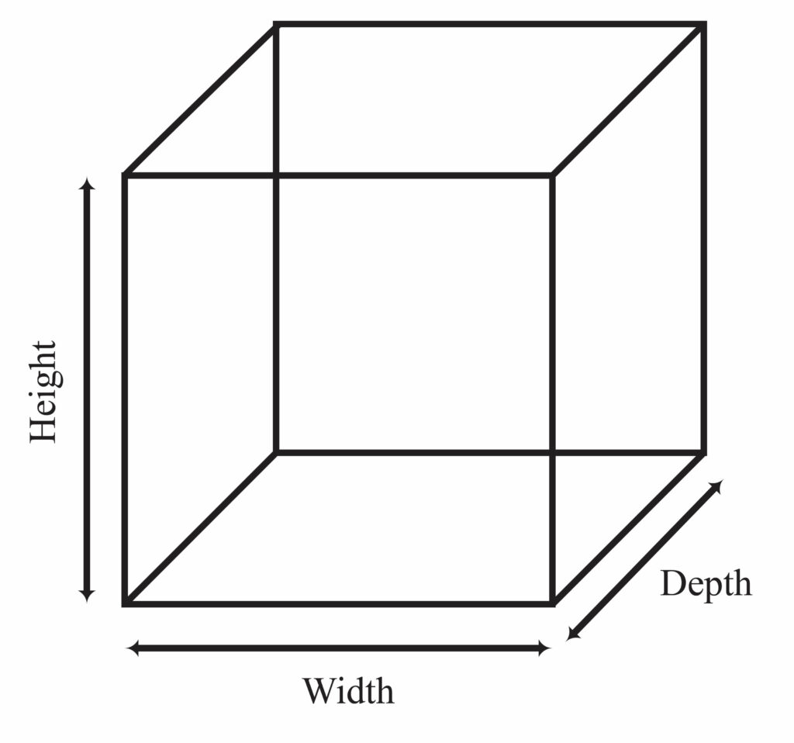

  

 **툴은 결국 망치와 같은 도구입니다.** 
  도구는 그것을 휘두르는 사람만큼 유용합니다. 

 결국 결과는 손 끝에 달렸고, 여전히 여러분의 툴을 사용하는 능력이 많은 것을 좌우합니다. 
 
 대부분의 공간을 다루는 BIM 프로그램에는 설계 및 문서화를 자동화하는 기능이 있습니다. 
 따라서, 설계를 정확하고 효율적이며 비용 효율적으로 표현하려면 BIM 소프트웨어 사용에 대한 숙련도(또는 전문성)를 개발하는 것이 최우선 과제입니다. 
 따라서 어떤 소프트웨어 옵션을 선택하느냐보다 건축가/디자이너에 대한 교육이 더 기본입니다.
 
 학생은 이러한 다양한 전문 프로그램에 대한 무료 교육 라이센스에 액세스할 수 있습니다. 그러니 직접 시승해보고, 과일을 맛보고, 스스로 결정하세요.
 ----
## 3D 모델링의 기본 개념
- 3D 모델링은 컴퓨터 그래픽스를 사용하여 물체의 세 가지 차원(너비, 높이, 깊이)을 표현하는 과정입니다.

  

- 3D 모델링은 건축과 디자인에서 중요한 역할을 합니다. 이를 통해 디자인과 구조를 시각화하고, 디자인을 개선하며, 프로토타입을 만들고, 사용자 경험을 시뮬레이션하는데 사용됩니다.
- 3D 모델링은 디자인의 효율성과 정확성을 높이며, 제품의 생산성과 품질을 향상시킵니다. 여러 가지 디자인 옵션을 탐색하며, 문제점을 미리 발견하고 수정할 수 있습니다. 또한, 3D 모델은 건축물의 실제 외관과 기능을 보여주는 훌륭한 프레젠테이션 도구로 사용될 수 있습니다.
- 이러한 기술은 교육, 엔터테인먼트, 의료, 부동산 등 다양한 분야에서 사용되고 있습니다.
---

## 1년 동안 다룰 툴 소개
- **스케치업:** 3D 모델링을 빠르게 수행하는데 적합하며, 간단한 형상을 만들 때 유용합니다.
- **엔스케이프:** Landscape design에 유용한 툴로 활용됩니다.
- **오토캐드/라이노:** 기본적인 2D 및 3D 모델링과 설계에 사용되며, 라이노는 복잡한 형상을 다루는데 뛰어납니다.
- **그래스호퍼:** 알고리즘 기반의 모델링과 디자인에 사용되며, 라이노와 통합하여 사용합니다.
- **레빗:** BIM 모델링 및 문서화를 자동화하는데 유용한 도구입니다.
- **VRay:** 렌더링 및 시각화에 사용되는 렌더링 엔진입니다.
