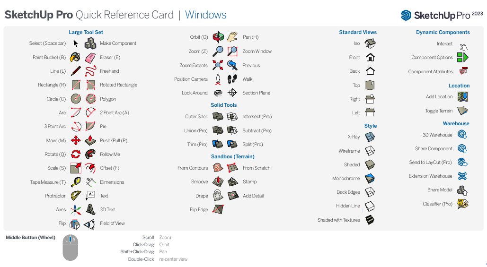
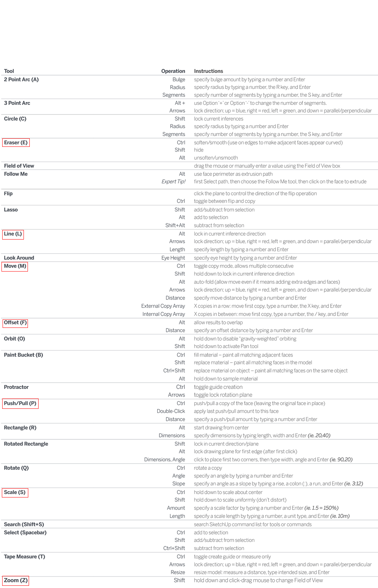

# 1. 스케치업 소개

스케치업(SketchUp)은 사용자 친화적인 3D 모델링 소프트웨어로, 건축, 인테리어 디자인, 기계 설계, 영화 및 비디오 게임 디자인 등 다양한 분야에서 사용됩니다.

<b>직관적인 디자인 프로세스</b> 사용자는 복잡한 명령어나 코드를 배울 필요 없이, 직관적으로 3D 모델을 설계할 수 있습니다.

<b>시각적 커뮤니케이션</b>:설계 아이디어를 빠르게 시각화하고, 클라이언트나 팀원과 효과적으로 소통할 수 있습니다.

<b>유연성과 호환성</b> 스케치업은 다른 CAD 소프트웨어나 그래픽 디자인 도구와의 호환성이 좋아, 디자인 워크플로우에 쉽게 통합될 수 있습니다.

1. **메뉴:** 프로그램의 주 기능을 담고 있으며, 파일 관리, 편집, 뷰, 카메라, 도구, 창, 도움말 등의 메뉴 항목이 있습니다. 각 항목을 클릭하면 관련된 하위 메뉴가 펼쳐집니다.

2. **툴바:** 자주 사용하는 도구를 빠르게 접근할 수 있도록 도와주는 공간입니다. 기본 도구, 도면 도구, 편집 도구, 카메라 도구, 건축 도구, 동적 구성 요소 도구 등 다양한 툴바가 있습니다.

3. **상태바:** 프로그램의 현재 상태를 나타내는 공간입니다. 선택한 도구의 기능, 현재 작업 중인 명령 등의 정보를 표시합니다.

4. **창:** 작업 공간을 나타냅니다. 3D 모델링을 진행하며, 모델의 다양한 뷰를 확인하거나 조절할 수 있습니다.
----

### 1.1 영문변환

**Resources 폴더 찾기:** 스케치업이 설치된 폴더로 이동합니다. 일반적으로 Windows의 경우 C:\Program Files\SketchUp\SketchUp [년도]\Resources에 위치합니다. 

**언어 폴더 이름 변경:** Resources 폴더 내에서 ko 폴더를 찾습니다. 이 폴더는 한국어 언어 리소스를 포함하고 있습니다. 
ko 폴더의 이름을 변경합니다.(ko_backup) 이렇게 하면 스케치업은 한국어 리소스를 찾을 수 없게 되어 기본 언어(영어)로 돌아갑니다.

https://blog.naver.com/design_iyagi/220562232602
----

### 1.3 세션: 기본 도구 사용법

  

---

  

----
**2. 기본 도구 및 기술 **
기본 모델링 도구: 선(Line), 면(Face), 도형(Rectangle, Circle, Polygon) 등의 기본 도구 사용법.
수정 도구: 이동(Move), 회전(Rotate), 스케일(Scale) 등의 기본 수정 도구 사용법.
뷰 및 네비게이션: 화면 이동(Pan), 확대/축소(Zoom), 회전(Orbit) 등의 뷰 조작 방법.
간단한 실습 프로젝트: 간단한 집이나 가구 모델링을 통해 배운 기술 실습.
3. 중급 기능 (60분)
그룹 및 구성요소: 모델의 효율적 관리를 위한 그룹(Group) 및 구성요소(Component)의 사용.
텍스처 및 재질: 재질(Material) 적용 방법과 텍스처 매핑.
차원 및 텍스트: 모델에 차원(Dimension) 추가, 주석(Text) 달기.
레이어 및 장면: 다양한 레이어 관리와 장면(Scene) 설정으로 프로젝트 정리.
4. 스케치업 웨어하우스 및 기타 리소스 (30분)
3D 웨어하우스: 3D 웨어하우스 사용법 및 리소스 검색, 모델에 적용하는 방법.
기타 유용한 리소스 소개: 플러그인, 튜토리얼, 커뮤니티 등.