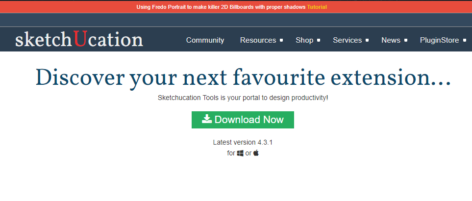

## 복잡한 형태 모델링, 루비 스크립트 기초

----

**스케치업의 필수 루비 리스트와 루비를 사용한 모델링:**

루비 스크립트는 SketchUp의 프로그래밍 언어로, 사용자가 SketchUp을 자동화하고 사용자 정의 기능을 추가하는 데 사용됩니다. 이는 모델링 작업을 빠르게 수행하고, 복잡한 형태를 생성하고, 반복적인 작업을 자동화하는 데 효과적입니다. 

스케치업은 3D 모델링 소프트웨어로, 다양한 플러그인을 통해 기능을 확장할 수 있습니다. 이러한 플러그인은 디자인 프로세스를 보다 효율적으로 만들어주며, 사용자의 작업을 보다 쉽게 만들어 줍니다.

**일부 유용한 플러그인 예시:**

1. **SketchUcation:** 이 플러그인은 스케치업 사용자 커뮤니티에서 생성된 수천 개의 플러그인과 모델을 다운로드할 수 있게 해주는 플러그인 관리자입니다.

2. **1001Bit Tools:** 이 플러그인은 건축 모델링을 더욱 쉽게 만들어주며, 계단, 창문, 문, 벽 등을 자동으로 생성하는 기능을 제공합니다.

3. **Curviloft:** 이 플러그인은 복잡한 3D 모양을 생성하는 데 도움이 됩니다. 이는 특히 곡선이나 비정형 모양의 건물을 디자인하는 데 유용합니다.

4. **Sketchy FFD:** 이 플러그인은 3D 모델의 형태를 자유롭게 조정하고 변형할 수 있게 해줍니다.

5. **RoundCorner:** 이 플러그인은 3D 모델의 모서리를 둥글게 만드는 데 사용됩니다.

6. **Artisan Organic Toolset:** 이 플러그인은 곡선과 부드러운 서피스를 가진 모델을 생성하는 데 필요한 다양한 도구를 제공합니다.

7. **Joint Push/Pull:** 이 플러그인은 3D 모델의 표면을 동시에 밀거나 당기는 기능을 제공합니다.

이러한 플러그인들은 스케치업의 기능을 확장하며, 사용자가 보다 복잡하고 정교한 3D 모델을 효과적으로 생성할 수 있게 돕습니다. 하지만, 각 플러그인의 특성과 기능을 정확히 이해하고 사용하는 것이 중요합니다.

----

https://m.blog.naver.com/skygiok/221584940850

